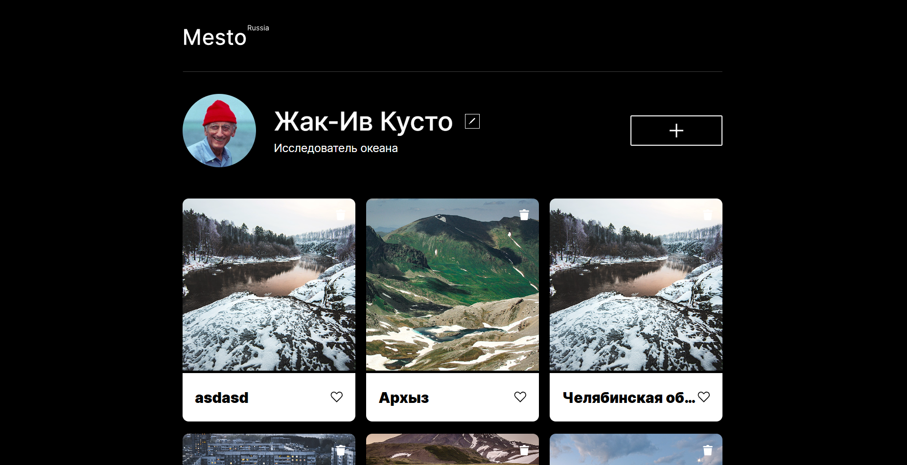
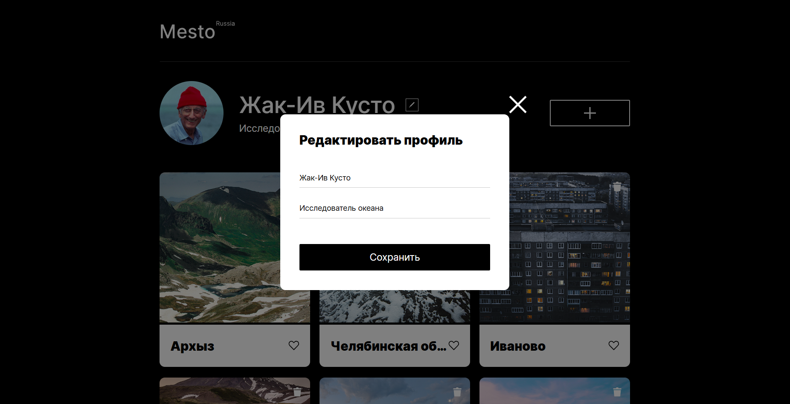
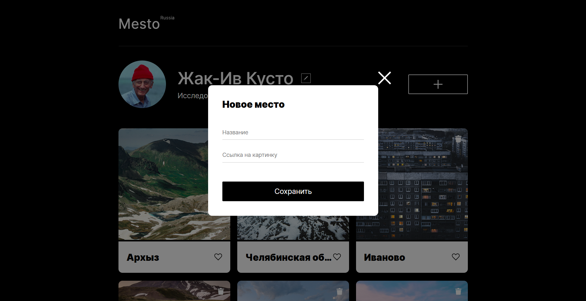
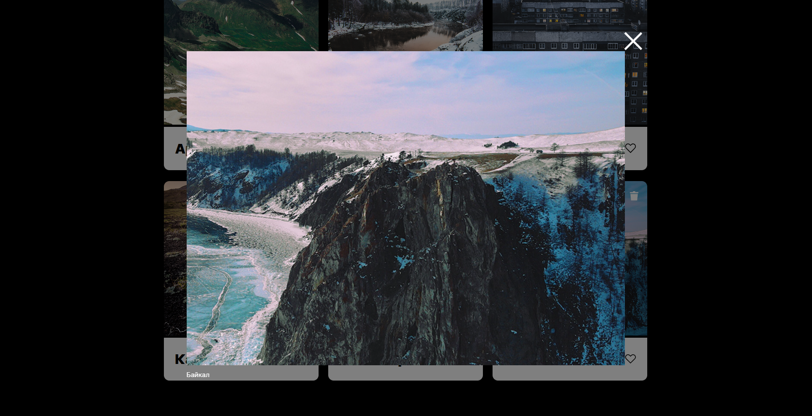

# Mesto
https://asfqx.github.io/mesto

**Mesto** — интерактивная веб-платформа для управления личным профилем и коллекцией карточек с изображениями.

## Возможности

- **Редактирование профиля**  
  Изменение имени и описания пользователя через попап с формой.

- **Добавление карточек**  
  Создание новых карточек с названием и изображением через форму в попапе.

- **Взаимодействие с карточками**  
  - Ставить и убирать лайки.  
  - Удалять карточки.  
  - Просматривать изображение в полном размере с подписью (название карточки).

- **Адаптивный дизайн**  
  Flexbox и Grid Layout обеспечивают корректное отображение на различных устройствах.

## Технологии
- Проект выполнен по методологии Git Flow с ветками: main, develop и feature.
- HTML5 — семантическая разметка.  
- CSS3 — Flexbox, Grid, медиа-запросы.  
- JavaScript (ES6 Modules) — динамическое создание карточек и работа с попапами.  
- Методология БЭМ — организация классов и блоков.  
- Normalize.css — сброс стандартных стилей браузера.

## Структура проекта

    ├── blocks/ # БЭМ-блоки (компоненты интерфейса)
    ├── pages/ # Стили страниц (index.css)
    ├── vendors/ # Сторонние файлы (normalize.css)
    │ └── fonts/ # Локальные шрифты
    ├── scripts/ # JS-файлы (cards.js, index.js)
    ├── images/ # Изображения и иконки
    ├── index.html # Основная HTML-страница
    └── README.md # Описание проекта

## Попапы

1. **Редактирование профиля** (`.popup_type_edit`)  
   Форма с полями `Имя` и `Занятие` и кнопкой сохранения.

2. **Добавление карточки** (`.popup_type_new-card`)  
   Форма с полями `Название` и `Ссылка на картинку`.

3. **Просмотр изображения** (`.popup_type_image`)  
   Отображение изображения в полном размере с подписью (названием карточки).

## Карточки

Карточки создаются динамически из шаблона (`<template id="card-template">`). Каждая карточка содержит:

- изображение (`.card__image`) с возможностью открытия попапа;  
- кнопку удаления (`.card__delete-button`);  
- название (`.card__title`);  
- кнопку лайка (`.card__like-button`).  

## Скриншоты

**Главная страница с профилем и карточками:**  
  

**Попап редактирования профиля:**  
  

**Попап добавления новой карточки:**  
  

**Просмотр изображения в попапе:**  
  
