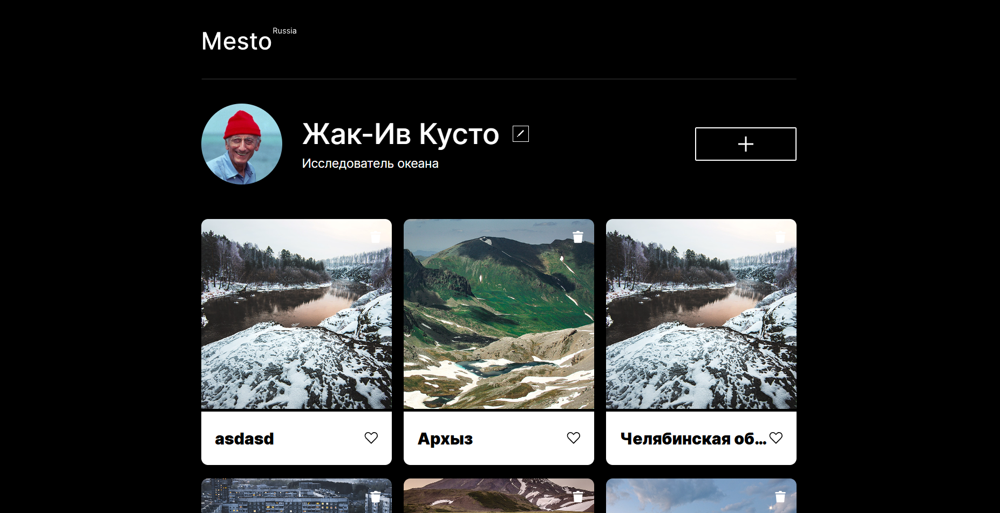
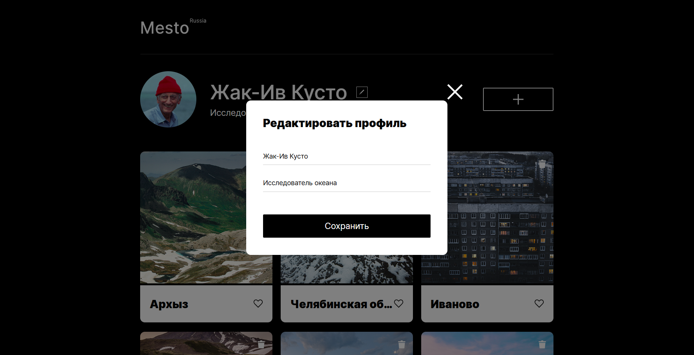
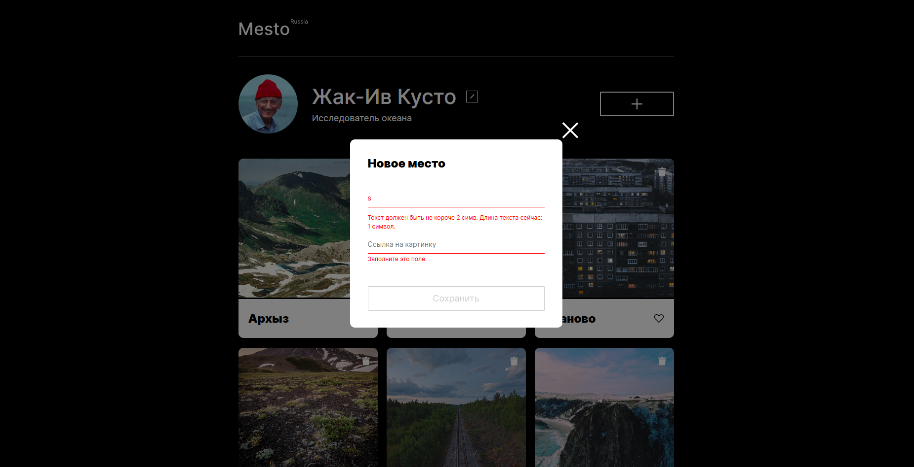
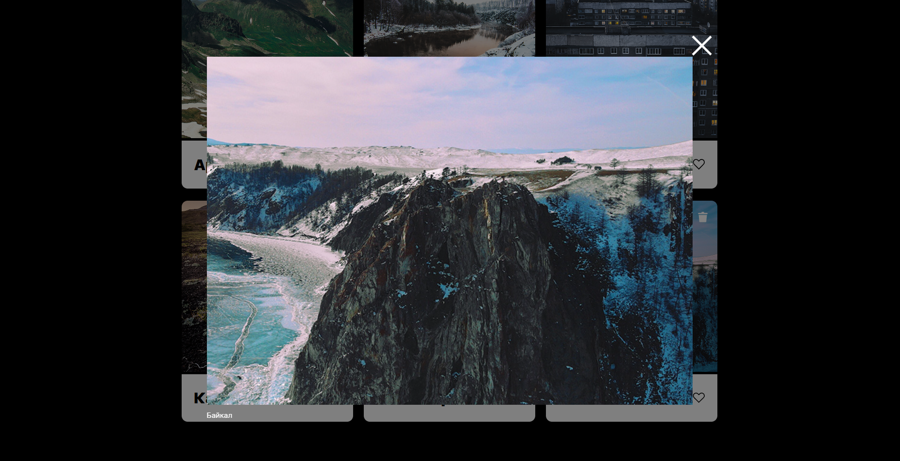

# Mesto
https://asfqx.github.io/mesto

**Mesto** — интерактивная веб-платформа для управления личным профилем и коллекцией карточек с изображениями.

  Проект собран с помощью Webpack и использует современные инструменты фронтенд-разработки.

## Возможности

- **Редактирование профиля**  
  Изменение имени и описания пользователя через попап с формой.

- **Добавление карточек**  
  Создание новых карточек с названием и изображением через форму в попапе.

- **Взаимодействие с карточками**  
  - Ставить и убирать лайки.  
  - Удалять карточки.  
  - Просматривать изображение в полном размере с подписью (название карточки).

- **Адаптивный дизайн**  
  Flexbox и Grid Layout обеспечивают корректное отображение на различных устройствах.

## Технологии
- **Git Flow** — ветки `main`, `develop`, `feature`.  
- **HTML5** — семантическая разметка.  
- **CSS3** — Flexbox, Grid, медиа-запросы.  
- **JavaScript (ES6 Modules)** — динамическое создание карточек и работа с попапами.  
- **БЭМ** — методология организации CSS-классов.  
- **Normalize.css** — сброс стандартных стилей браузера.  
- **npm + Webpack**:  
  - `webpack`, `webpack-cli`, `webpack-dev-server` — сборка, запуск и горячая перезагрузка.  
  - `babel-loader`, `@babel/core`, `@babel/preset-env` — транспиляция современного JS.  
  - `mini-css-extract-plugin`, `css-loader` — работа со стилями.  
  - `html-webpack-plugin` — генерация HTML.  
  - `clean-webpack-plugin` — очистка директории `dist` перед сборкой.  
  - `rimraf` — очистка вручную (при необходимости).

## Структура проекта

```
├── dist/              # Сборка проекта
├── node_modules/      # Установленные пакеты
├── src/               # Исходные файлы
│   ├── scripts/       # JS (cards.js, index.js, card.js, validate.js, modal.js, )
│   ├── blocks/        # БЭМ-блоки (стили компонентов)
│   ├── pages/         # Стили страниц (index.css)
│   ├── vendors/       # Сторонние файлы (normalize.css, шрифты)
│   ├── images/        # Изображения и иконки
│   └── index.html     # Основной HTML
├── .gitignore
├── babel.config.js
├── package.json
├── package-lock.json
├── postcss.config.js
├── webpack.config.js
└── README.md
```

## Попапы

1. **Редактирование профиля** (`.popup_type_edit`)  
   Форма с полями `Имя` и `Занятие` и кнопкой сохранения.

2. **Добавление карточки** (`.popup_type_new-card`)  
   Форма с полями `Название` и `Ссылка на картинку`.

3. **Просмотр изображения** (`.popup_type_image`)  
   Отображение изображения в полном размере с подписью (названием карточки).

Дополнительно реализовано удобное закрытие модальных окон:
- **По клику вне содержимого**; 
- **По клавише `Escape`** (если есть открытый попап с классом).  

## Карточки

Карточки создаются динамически из шаблона (`<template id="card-template">`). Каждая карточка содержит:

- изображение (`.card__image`) с возможностью открытия попапа;  
- кнопку удаления (`.card__delete-button`);  
- название (`.card__title`);  
- кнопку лайка (`.card__like-button`).  

## Валидация форм

В проекте реализована **клиентская валидация форм** на чистом JavaScript.  
Основная цель — обеспечить корректность данных до отправки и сделать интерфейс более удобным.

- Пользователь не сможет отправить форму с пустыми или некорректными данными.  
- Все ошибки отображаются сразу при вводе.  
- Кнопка отправки автоматически блокируется/разблокируется в зависимости от валидности полей.  
- Попапы можно удобно закрывать мышкой или клавиатурой.


## Скриншоты

**Главная страница с профилем и карточками:**  
  

**Попап редактирования профиля:**  
  

**Попап добавления новой карточки:**  
  

**Просмотр изображения в попапе:**  
  

---

## Установка и запуск проекта

1. **Клонируйте репозиторий**  
   ```bash
   git clone https://github.com/asfqx/mesto.git
   cd mesto
   ```

2. **Установите зависимости**  
   ```bash
   npm install
   ```

3. **Запуск в режиме разработки (c hot reload)**  
   ```bash
   npm run dev
   ```
   Проект будет доступен по адресу: [http://localhost:8080](http://localhost:8080)

4. **Сборка проекта для продакшена**  
   ```bash
   npm run build
   ```
   Готовые файлы будут в папке `dist/`.

---
